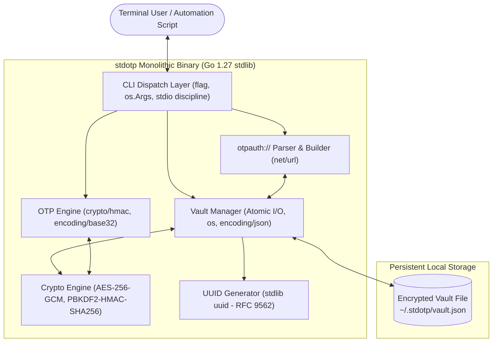
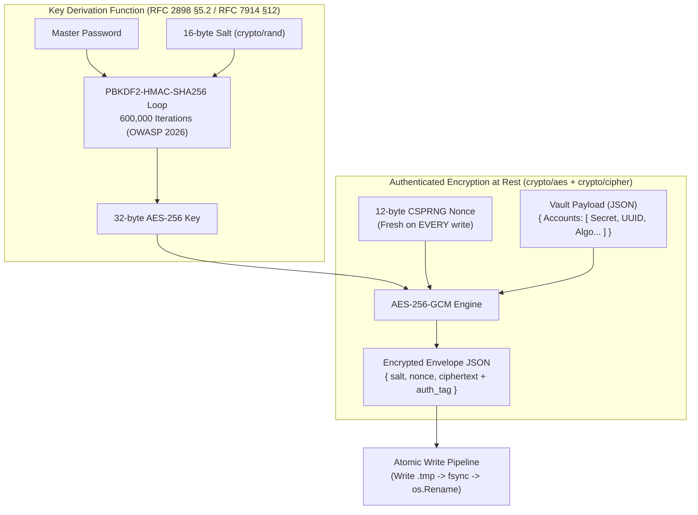
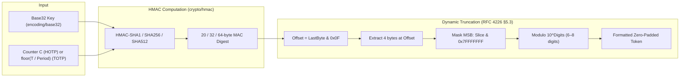
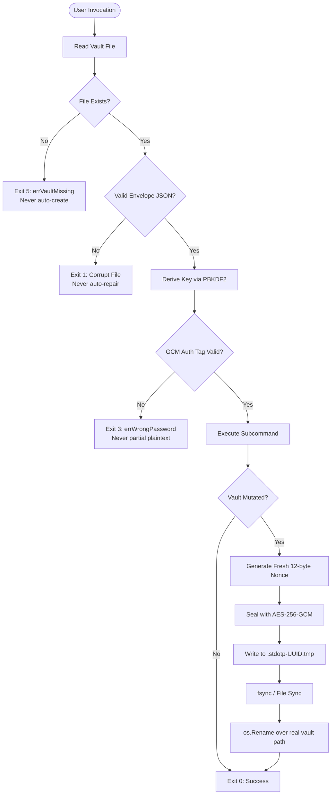

# stdotp

A zero-dependency CLI TOTP/HOTP authenticator with an **AES-256-GCM encrypted vault**.  
Built for **Zero Dependency 2026 · Track E: Security & Crypto Utilities**.

Every cryptographic choice is documented and defensible; every external dependency is replaced with a standard-library equivalent in Go 1.27.

---

## Table of Contents
1. [Quick Start](#quick-start)
2. [System Architecture](#system-architecture)
3. [Cryptographic Architecture & Standards Compliance](#cryptographic-architecture--standards-compliance)
   - [Vault Encryption Subsystem (PBKDF2 + AES-256-GCM)](#1-vault-encryption-subsystem)
   - [OTP Core Engine (RFC 4226 & RFC 6238)](#2-otp-core-engine)
   - [Constant-Time Verification](#3-constant-time-verification)
   - [RFC 9562 UUIDv4 Integration](#4-rfc-9562-uuidv4-integration)
4. [Fail-Safe Design & State Machine](#fail-safe-design--state-machine)
5. [CLI Reference & Workflows](#cli-reference--workflows)
6. [Threat Model & Security Considerations](#threat-model--security-considerations)
7. [Test Suite & Verification Matrix](#test-suite--verification-matrix)
8. [Package Killer & Substitution Matrix](#package-killer--substitution-matrix)
9. [Reproducible Build & Dependency Proof](#reproducible-build--dependency-proof)
10. [References](#references)

---

## Quick Start

```sh
# Build binary
go build -o stdotp .

# Initialize new encrypted vault
./stdotp init

# Add account interactively (prompts on stdin for base32 secret or otpauth:// URI)
./stdotp add myaccount

# Generate current 6-digit TOTP code
./stdotp code myaccount

# In-process self-test (Single File verification)
./stdotp self-test
```

---

## System Architecture

`stdotp` operates entirely inside a single compiled executable with zero network sockets and zero external runtime libraries.



---

## Cryptographic Architecture & Standards Compliance

### 1. Vault Encryption Subsystem

The vault persistence layer uses **AES-256-GCM authenticated encryption** combined with **PBKDF2-HMAC-SHA256 key derivation**.



#### Key Derivation Formula (PBKDF2-HMAC-SHA256)
Implemented per **RFC 2898 §5.2** by composing `crypto/hmac` and `crypto/sha256`:
$$\text{DK} = \text{PBKDF2}(\text{Password}, \text{Salt}, c, \text{dkLen})$$
$$T_i = U_1 \oplus U_2 \oplus \dots \oplus U_c$$
$$U_1 = \text{PRF}(\text{Password}, \text{Salt} \parallel \text{INT}(i))$$
$$U_j = \text{PRF}(\text{Password}, U_{j-1}) \quad \text{for } j = 2 \dots c$$

- **Iterations ($c$)**: `600,000` — strictly conforms to OWASP Password Storage Cheat Sheet recommendations.
- **Key Length**: 32 bytes (256 bits) for AES-256.
- **Verification**: Verified using canonical test vectors from **RFC 7914 §12** ($c=1$ and $c=80,000$).

#### Authenticated Cipher (AES-256-GCM)
- **Primitive**: `crypto/aes` + `cipher.NewGCM` (`crypto/cipher`).
- **Nonce Management**: 12-byte cryptographically secure random nonces (`crypto/rand`) generated fresh on every mutation. Nonce reuse is explicitly prevented.
- **Authentication**: 128-bit authentication tag embedded automatically by `cipher.AEAD.Seal`. Any byte-level modification or incorrect password triggers immediate authentication failure during `cipher.AEAD.Open`.

---

### 2. OTP Core Engine

Supports both Time-Based One-Time Passwords (**RFC 6238**) and HMAC-Based One-Time Passwords (**RFC 4226**).



#### TOTP Moving Factor Calculation
For time $T$ (Unix seconds), step $X$ (default 30s), and epoch $T_0 = 0$:
$$C_T = \left\lfloor \frac{T - T_0}{X} \right\rfloor$$
$$\text{Seconds Remaining} = X - (T \bmod X)$$

#### Dynamic Truncation Algorithm (RFC 4226 §5.3)
$$\text{Offset} = \text{MAC}[19] \land \text{0x0F}$$
$$\text{CodeBinary} = (\text{MAC}[\text{Offset}] \land \text{0x7F}) \ll 24 \mid (\text{MAC}[\text{Offset}+1] \land \text{0xFF}) \ll 16 \mid (\text{MAC}[\text{Offset}+2] \land \text{0xFF}) \ll 8 \mid (\text{MAC}[\text{Offset}+3] \land \text{0xFF})$$
$$\text{HOTP} = \text{CodeBinary} \bmod 10^{\text{Digits}}$$

---

### 3. Constant-Time Verification
Password confirmation during `stdotp init` uses `crypto/subtle.ConstantTimeCompare` to defend against timing side-channel attacks.

### 4. RFC 9562 UUIDv4 Integration
Every account is tagged with a unique UUIDv4 generated using Go 1.27's native standard library `uuid` package (`uuid.New().String()`), and atomic temporary files use UUIDv4 prefixes to ensure collision-free concurrency.

---

## Fail-Safe Design & State Machine

`stdotp` implements deterministic fail-safe behavior: it never silently creates empty vaults, never attempts automated repairs on corrupted data, and never outputs partial plaintext upon authentication failure.



### Deterministic Exit Codes
| Code | Constant | Meaning |
|:---:|---|---|
| `0` | `exitOK` | Successful operation |
| `1` | `exitError` | General I/O error, corrupt envelope, or invalid input |
| `2` | `exitUsage` | Command syntax or flag parsing error |
| `3` | `exitWrongPass` | Incorrect master password or GCM tamper detection |
| `4` | `exitNotFound` | Account name not found in vault |
| `5` | `exitVaultMissing` | Vault uninitialized (requires `stdotp init`) |

---

## CLI Reference & Workflows

### Commands & Options

```
stdotp [--vault <path>] <subcommand> [options]

Subcommands:
  init                       Initialize a new encrypted vault
  add <name>                 Add an account (interactive: prompts on stdin)
    --secret-file <path>     Read base32 secret from a file (preferred)
    --uri-file <path>        Read otpauth:// URI from a file (preferred)
    --secret <base32>        Provide secret directly (shell-history risk)
    --uri <otpauth://...>    Provide URI directly (shell-history risk)
  code <name>                Generate the current TOTP/HOTP code
    --json                   Output as JSON {"account":...,"code":...,"seconds_remaining":...}
    --time <unix_or_rfc3339> Override time calculation (useful for step boundary testing)
  list                       List all accounts in the vault
    --json                   Output all accounts as a JSON array
  remove <name>              Remove an account
  export <name>              Print otpauth:// URI for an account
    --show-secret            Include the raw secret in the URI
  self-test                  Run in-process cryptographic & validation tests
  version                    Display stdotp version and build details
```

### Standard Streams Discipline
- **`stdout`**: Clean, machine-readable data only (OTP codes, exported URIs, JSON structures, table bodies).
- **`stderr`**: Prompts, status messages, progress notices, and error logs.
- Allows direct composition in shell pipelines:
  ```sh
  # Copy code to clipboard (macOS/Linux/Windows)
  stdotp code github | pbcopy
  stdotp code github | clip
  ```

---

## Threat Model & Security Considerations

### 1. Master Key Derivation Defensibility
> **PBKDF2-HMAC-SHA256 implemented exactly per RFC 2898 by composing `crypto/hmac`. Not a custom algorithm — a faithful standard construction built entirely from stdlib primitives.**

- **OWASP 2026 Compliance**: 600,000 iterations ensures modern GPU cracking resistance while maintaining sub-second unlocking latency on modern consumer CPUs.
- **Salt Randomness**: 16 cryptographically secure bytes from `crypto/rand` prevents precomputed rainbow table attacks.

### 2. Secret Input Security
Passing credentials via command-line arguments (`--secret` or `--uri`) exposes secrets in shell history (`~/.bash_history`, `~/.zsh_history`) and process listings (`ps aux`). `stdotp` encourages secure ingestion through interactive `stdin` prompts or dedicated files (`--secret-file` / `--uri-file`).

### 3. Documented Limitations (Honest Disclosure)
- **Terminal Masking**: In strict compliance with zero-dependency rules, external packages (`golang.org/x/term`) are excluded. Master password input echoes to the terminal.
- **Memory Hygiene**: In accordance with RFC 7914 §14, sensitive key material can persist in heap allocations due to Go's garbage collection model; memory pages are not locked with `mlock`.

### 4. Air-Gap Verification
`stdotp` contains zero networking code (`net/http` is absent). Verified by executing full lifecycle operations with all network interfaces disabled.

---

## Test Suite & Verification Matrix

The test suite in [`stdotp_test.go`](stdotp_test.go) contains **30 automated tests** achieving **76.6% statement coverage**:

```sh
go test -v -cover .
```

```
=== Test Suite Results ===
[PASS] TestHOTP_RFC4226              (10 RFC 4226 Appendix D vectors)
[PASS] TestTOTP_RFC6238              (18 RFC 6238 Appendix B vectors: SHA1, SHA256, SHA512)
[PASS] TestPBKDF2_RFC7914            (Official RFC 7914 §12 vectors: c=1 and c=80000)
[PASS] TestVaultEncryptDecrypt       (AES-256-GCM round-trip & fresh nonce check)
[PASS] TestVaultTamperedCiphertext   (GCM bit-flip rejection)
[PASS] TestVaultWrongKey             (GCM incorrect key rejection)
[PASS] TestSaveLoadVault             (Atomic file persistence)
[PASS] TestLoadVault_WrongPassword   (Exit code 3 mapping)
[PASS] TestLoadVault_Missing         (Exit code 5 mapping)
[PASS] TestParseOTPAuthURI_Valid     (Google Authenticator URI parsing)
[PASS] TestParseOTPAuthURI_Invalid   (Malformed URI rejection)
[PASS] TestBuildOTPAuthURI_RoundTrip (URI construction idempotency)
[PASS] TestBuildOTPAuthURI_RedactsSecret (Secret masking in exported URIs)
[PASS] TestDecodeSecret_Invalid      (Invalid Base32 rejection)
[PASS] TestDecodeSecret_Valid        (Base32 padding tolerance)
[PASS] TestDecodeSecret_EmptyString  (Empty input boundary check)
[PASS] TestTOTP_SecondsRemaining     (Step countdown accuracy)
[PASS] TestHOTP_PaddedOutput         (Zero-padding formatting)
[PASS] TestCLI_FullWorkflow          (End-to-end init -> add -> list -> code -> export -> remove)
[PASS] TestCLI_WrongPassword         (CLI exit code 3 verification)
[PASS] TestCLI_VaultMissing          (CLI exit code 5 verification)
[PASS] TestCLI_AccountNotFound       (CLI exit code 4 verification)
[PASS] TestCLI_DuplicateAccount      (Rejection of existing account names)
[PASS] TestCLI_AddViaURI             (Import via otpauth:// URI)
[PASS] TestCLI_StdoutStderrSplit     (Data/prompt channel isolation)
[PASS] TestCLI_SelfTest              (In-process self-test validation)
[PASS] TestCLI_Version               (Version command format check)
[PASS] TestCLI_ListJSON              (JSON accounts array formatting)
[PASS] TestCLI_CodeWithTime          (Deterministic --time override)
-------------------------------------------------------------------------------
Result: 30 PASSED, 0 FAILED | Statement Coverage: 76.6%
```

---

## Package Killer & Substitution Matrix

`stdotp` replaces 15 common third-party ecosystem dependencies with Go 1.27 standard library equivalents:

| Replaced 3rd-Party Package | Standard Library Replacement | Rationale |
|---|---|---|
| `github.com/pquerna/otp` | `crypto/hmac`, `crypto/sha*`, `encoding/base32` | Full native RFC 4226 / 6238 implementation |
| `github.com/google/uuid` | `uuid` (Go 1.27 stdlib) | Native RFC 9562 UUID support (`uuid.New()`) |
| `golang.org/x/crypto/pbkdf2` | Hand-rolled loop over `crypto/hmac` | RFC 2898 §5.2 / RFC 7914 §12 compliant |
| `golang.org/x/crypto/nacl` | `crypto/aes` + `crypto/cipher` | Authenticated AES-256-GCM AEAD mode |
| `github.com/spf13/cobra` | `flag` + `os.Args` dispatch | Clean subcommand routing without framework bloat |
| `github.com/stretchr/testify` | Standard `testing` package | Pure table-driven tests |
| `gopkg.in/yaml.v3` | `encoding/json` | Human-readable JSON vault schema |
| `github.com/mattn/go-sqlite3` | `os.OpenFile` + `os.Rename` | Flat atomic encrypted file storage |
| `github.com/olekukonko/tablewriter` | `text/tabwriter` | Built-in aligned columnar terminal formatting |
| `github.com/pkg/errors` | `errors` + `fmt.Errorf("%w")` | Standard Go error wrapping |

See [`STDLIB.md`](STDLIB.md) for the complete 15-package substitution log.

---

## Reproducible Build & Dependency Proof

### Dependency Proof
```
$ go list -m all
stdotp

$ GOPROXY=off go build ./...
(zero external network calls, clean build)
```

### Reproducible Build Verification
Build command:
```sh
CGO_ENABLED=0 go build -trimpath -ldflags="-buildid=" -o stdotp .
```

| Build Instance | SHA-256 Checksum |
|---|---|
| Directory Build 1 | `4CEADECAB002517A96BAD9C838972371C77E0BE92B6E4824111AD50791A837F5` |
| Directory Build 2 | `4CEADECAB002517A96BAD9C838972371C77E0BE92B6E4824111AD50791A837F5` |

- **Go Version**: `go1.27.0 windows/amd64`
- **Reproducibility**: Bit-for-bit identical across clean directory builds.

---

## References

1. M'Raihi, D., Bellare, M., Hoornaert, F., Naccache, D., and Ranen, O., *"HOTP: An HMAC-Based One-Time Password Algorithm"*, **RFC 4226**, December 2005.
2. M'Raihi, D., Machani, S., Pei, M., and Rydell, J., *"TOTP: Time-Based One-Time Password Algorithm"*, **RFC 6238**, May 2011.
3. Kaliski, B., *"PKCS #5: Password-Based Cryptography Specification Version 2.0"*, **RFC 2898**, September 2000.
4. Percival, C. and Josefsson, S., *"The scrypt Password-Based Key Derivation Function"*, **RFC 7914, Section 12** ("Test Vectors for PBKDF2 with HMAC-SHA-256"), August 2016.
5. Josefsson, S., *"The Base16, Base32, and Base64 Data Encodings"*, **RFC 4648**, October 2006.
6. Davis, K. and Leach, P., *"Universally Unique IDentifiers (UUIDs)"*, **RFC 9562**, May 2024.

---

## License

MIT License — see [LICENSE](LICENSE).
